# Task: Create observability.html page with Mermaid architecture diagram

> Handoff spec for Claude Code terminal. Creates a new page in Pillar 3 ("The Build") showing the observability stack architecture as an interactive Mermaid diagram with supporting content.

## Context

Intent's observability infrastructure is defined in `spec/observability-stack.md` (in the product repo). This page visualizes that architecture for the site. It belongs in Pillar 3 alongside architecture.html, deployment.html, and arb.html.

Read `site-ia.md` and `site-spec.md` before starting. Follow the CSS strategy (shared styles.css + page-specific `<style>` block). Follow the Pillar 3 page pattern from architecture.html.

## Page: `docs/observability.html`

### Nav Configuration

**Primary nav:** "The Build" active
**Sub-nav:** Pillar 3 sub-nav with "Observability" as active link

The Pillar 3 sub-nav must be updated across ALL Pillar 3 pages to include the new link:
```html
<nav class="sub-nav">
  <a href="architecture.html">Overview</a>
  <a href="agents.html">Agents</a>
  <a href="deployment.html">Deployment</a>
  <a href="observability.html" class="active">Observability</a>
  <a href="arb.html">ARB</a>
  <a href="decisions.html">Decisions</a>
  <a href="native-repos.html">Repos</a>
</nav>
```

**Important:** Update the sub-nav on ALL Pillar 3 pages: architecture.html, agents.html, deployment.html, arb.html, decisions.html, native-repos.html. Each page keeps its own link as `class="active"`.

### Page Structure

```
┌─────────────────────────────────────────────┐
│ Primary Nav (The Build active)              │
│ Sub-Nav (Observability active)              │
├─────────────────────────────────────────────┤
│ HERO                                        │
│ Kicker: OBSERVE INFRASTRUCTURE              │
│ Title: Observability Stack                  │
│ Subtitle: OTel-native distributed tracing   │
│ for the Intent loop                         │
├─────────────────────────────────────────────┤
│                                             │
│ MERMAID DIAGRAM (centerpiece)               │
│ Full architecture: sources → collector →    │
│ backends → Grafana                          │
│                                             │
├─────────────────────────────────────────────┤
│ THREE DEPLOYMENT PHASE CARDS                │
│ Phase 1: Grafana Cloud (green border)       │
│ Phase 2: Docker Compose (blue border)       │
│ Phase 3: k3s (amber border)                 │
├─────────────────────────────────────────────┤
│ TRACE IDENTITY MODEL                        │
│ Visual: Intent = Trace → Spec = Span →      │
│ Contract = Leaf Span diagram                │
├─────────────────────────────────────────────┤
│ METRICS TABLE                               │
│ Counters, gauges, histograms with names     │
├─────────────────────────────────────────────┤
│ DASHBOARD PREVIEW                           │
│ ASCII/styled panel layout showing what the  │
│ Grafana Observe dashboard looks like        │
├─────────────────────────────────────────────┤
│ Footer                                      │
└─────────────────────────────────────────────┘
```

### Mermaid Diagram

Use Mermaid.js loaded from CDN. The diagram is the centerpiece visual — it should be large, readable, and use Intent's persona colors.

```html
<script src="https://cdnjs.cloudflare.com/ajax/libs/mermaid/10.9.1/mermaid.min.js"></script>
<script>
  mermaid.initialize({
    startOnLoad: true,
    theme: 'dark',
    themeVariables: {
      primaryColor: '#1e293b',
      primaryTextColor: '#f1f5f9',
      primaryBorderColor: '#334155',
      lineColor: '#64748b',
      secondaryColor: '#0f172a',
      tertiaryColor: '#1e293b',
      fontFamily: 'Inter, system-ui, sans-serif'
    }
  });
</script>
```

The Mermaid graph definition — adapt and style this:

```mermaid
graph TB
    subgraph Sources["📡 TELEMETRY SOURCES"]
        CLI["CLI Tools<br/>intent-signal, intent-spec"]
        MCP["MCP Servers<br/>notice · spec · observe"]
        GHA["GitHub Actions<br/>intent-events.yml"]
        CC["Claude Code<br/>Terminal sessions"]
        JSONL["events.jsonl<br/>Git-tracked audit log"]
    end

    subgraph Collector["⚙️ OTEL COLLECTOR"]
        OTLP["OTLP Receiver<br/>gRPC :4317 · HTTP :4318"]
        PROC["Processors<br/>batch · attributes · filter"]
    end

    subgraph Backend["💾 STORAGE BACKENDS"]
        TEMPO["Grafana Tempo<br/>Trace storage"]
        MIMIR["Grafana Mimir<br/>Metrics storage"]
        LOKI["Grafana Loki<br/>Log aggregation"]
    end

    subgraph Dashboard["📊 VISUALIZATION"]
        GRAF["Grafana<br/>Intent Observe Dashboard"]
    end

    CLI --> JSONL
    MCP --> JSONL
    GHA --> JSONL

    JSONL -->|"File Tail Adapter"| OTLP
    CC -->|"intent-execute wrapper"| OTLP
    GHA -->|"Webhook (Phase 2)"| OTLP

    OTLP --> PROC
    PROC --> TEMPO
    PROC --> MIMIR
    PROC --> LOKI

    TEMPO --> GRAF
    MIMIR --> GRAF
    LOKI --> GRAF

    style Sources fill:#1a1a2e,stroke:#f59e0b,stroke-width:2px
    style Collector fill:#1a1a2e,stroke:#3b82f6,stroke-width:2px
    style Backend fill:#1a1a2e,stroke:#10b981,stroke-width:2px
    style Dashboard fill:#1a1a2e,stroke:#8b5cf6,stroke-width:2px
```



**Colors map to persona roles:**
- Sources (amber) = Practitioner-Architect (△) — where observations originate
- Collector (blue) = Product-Minded Leader (◇) — routing and processing
- Backend (green) = AI Agent (◉) — storage and computation
- Dashboard (purple) = Design-Quality Advocate (○) — visualization and quality

### Trace Identity Diagram

A second, smaller Mermaid diagram showing the span hierarchy:

```mermaid
graph LR
    subgraph Trace["TRACE: INT-003"]
        SIG1["SIG-006<br/>Signal"] --> CLUSTER["Cluster"]
        SIG2["SIG-008<br/>Signal"] --> CLUSTER
        CLUSTER -->|"promote"| INT["INT-003<br/>Intent"]
        INT --> SPEC["SPEC-004<br/>Spec"]
        SPEC --> CON1["CON-012<br/>Contract ✓"]
        SPEC --> CON2["CON-013<br/>Contract ✗"]
    end

    style SIG1 fill:#1e293b,stroke:#f59e0b
    style SIG2 fill:#1e293b,stroke:#f59e0b
    style INT fill:#1e293b,stroke:#3b82f6
    style SPEC fill:#1e293b,stroke:#3b82f6
    style CON1 fill:#1e293b,stroke:#10b981
    style CON2 fill:#1e293b,stroke:#ef4444
```



### Deployment Phase Cards

Three cards in a grid, same pattern as architecture.html phase-cards:

**Phase 1 — Grafana Cloud** (green border)
- Cost: $0
- Runs: OTel Collector binary + Python adapter (local)
- Stores: Grafana Cloud free tier (50GB traces, 50GB logs, 10K metrics)
- When: Solo practitioner, starting now

**Phase 2 — Docker Compose** (blue border)
- Cost: ~$5/month VPS
- Runs: Tempo + Mimir + Loki + Grafana + Collector (containers)
- Stores: Local disk, unlimited retention
- When: Always-on processing needed, laptop goes offline

**Phase 3 — k3s** (amber border)
- Cost: Variable
- Runs: Kubernetes-orchestrated stack + Kafka
- Stores: Object storage (S3/GCS)
- When: Multiple teams, cross-repo tracing

### Metrics Table

Use the schema-table pattern from architecture.html. Three sections: Counters, Gauges, Histograms. Content from the Metrics Model section of `spec/observability-stack.md`.

### Dashboard Preview

A styled div showing the Grafana panel layout (ASCII-art rendered with monospace font and colored borders):

```
┌──────────┬──────────┬──────────┬────────────┐
│ Signals  │ Intents  │ Specs    │ Contracts  │
│   24     │    5     │    3     │  12✓  1✗   │
├──────────┴──────────┴──────────┴────────────┤
│ CYCLE TIME        │ TRUST DISTRIBUTION      │
│ Sig→Int:  2.1d    │ L0 ██░░░░ 3            │
│ Int→Spec: 1.4d    │ L2 █████░ 8            │
│ Spec→Done: 0.8d   │ L4 ██░░░░ 2            │
├───────────────────┴─────────────────────────┤
│ EVENT STREAM (live)                         │
│ 10:42 signal.created  SIG-025 source=mcp   │
│ 10:38 contract.passed CON-014 spec=SPEC-003│
└─────────────────────────────────────────────┘
```

Style this as a dark card with monospace font, colored stat numbers (green for pass, red for fail), and subtle grid lines.

### Diagram Source Link (required — see Diagram Source Policy in site-ia.md)

Extract the Mermaid diagram definition into a standalone file at `docs/diagrams/observability-stack.mermaid` and link to it from the page:

```html
<a href="https://github.com/theparlor/intent/blob/main/docs/diagrams/observability-stack.mermaid" class="source-link">
  View Mermaid source →
</a>
```

Place this link directly below the rendered Mermaid diagram. Engineers will use this to embed the diagram in their own docs and PRs.

### Cross-links

Include contextual links to:
- "View Mermaid source →" → GitHub raw Mermaid file (see above)
- architecture.html → "See the MCP server topology that generates these events"
- event-catalog.html → "See the 15 event types this stack ingests"
- deployment.html → "See the MCP deployment topology"
- arb.html → "See the tech radar placement of OTel, Grafana, Tempo"

### Page Size Target

Minimum 12KB (Rich page with Mermaid diagrams, phase cards, metrics table, dashboard preview).

## Also Required: Update Pillar 3 Sub-Nav on Existing Pages

Update the sub-nav on these pages to include the Observability link:
- `docs/architecture.html`
- `docs/agents.html`
- `docs/deployment.html`
- `docs/arb.html`
- `docs/decisions.html`
- `docs/native-repos.html`

Each page's sub-nav should match the template above, with their own link as `class="active"`.

## Verification

```bash
cd ~/Workspaces/Core/frameworks/intent-site

# 1. Page exists and is above size target
[ -f docs/observability.html ] && echo "PASS: file exists" || echo "FAIL: file missing"
FILE_SIZE=$(wc -c < docs/observability.html)
[ "$FILE_SIZE" -gt 12000 ] && echo "PASS: size ${FILE_SIZE} > 12KB" || echo "FAIL: size ${FILE_SIZE} < 12KB"

# 2. Mermaid script loaded
grep -q 'mermaid' docs/observability.html && echo "PASS: mermaid loaded" || echo "FAIL: no mermaid"

# 3. Contains mermaid diagram definition
grep -q 'class="mermaid"' docs/observability.html && echo "PASS: mermaid diagram present" || echo "FAIL: no mermaid diagram"

# 4. Nav structure correct
grep -q 'architecture.html" class="active">The Build' docs/observability.html || grep -q 'The Build</a>' docs/observability.html && echo "PASS: primary nav present" || echo "FAIL: primary nav"
grep -q 'observability.html" class="active"' docs/observability.html && echo "PASS: sub-nav active" || echo "FAIL: sub-nav active state"

# 5. Sub-nav updated on ALL Pillar 3 pages
for page in architecture.html agents.html deployment.html arb.html decisions.html native-repos.html; do
  grep -q 'observability.html' "docs/$page" && echo "PASS: $page has observability link" || echo "FAIL: $page missing observability link"
done

# 6. Phase cards present
grep -q 'Phase 1' docs/observability.html && grep -q 'Phase 2' docs/observability.html && grep -q 'Phase 3' docs/observability.html && echo "PASS: deployment phases" || echo "FAIL: missing phases"

# 7. Metrics section present
grep -q 'intent.signals' docs/observability.html && echo "PASS: metrics section" || echo "FAIL: no metrics"

# 8. Mermaid source file exists
[ -f docs/diagrams/observability-stack.mermaid ] && echo "PASS: mermaid source exists" || echo "FAIL: mermaid source missing"

# 9. Page links to Mermaid source
grep -q 'observability-stack.mermaid' docs/observability.html && echo "PASS: mermaid source link" || echo "FAIL: no mermaid source link"
grep -q 'View Mermaid source' docs/observability.html && echo "PASS: source link text" || echo "FAIL: missing source link text"
```

## Commit

```bash
cd ~/Workspaces/Core/frameworks/intent-site
git add docs/observability.html docs/diagrams/observability-stack.mermaid
git add docs/architecture.html docs/agents.html docs/deployment.html docs/arb.html docs/decisions.html docs/native-repos.html
git commit -m "Add observability.html page with Mermaid architecture diagram + source

New Pillar 3 depth page showing the OTel-native observability stack:
- Mermaid architecture diagram (sources → collector → backends → Grafana)
- Trace identity model visualization (Intent=Trace, Spec=Span)
- Three deployment phase cards (Grafana Cloud → Docker → k3s)
- Metrics table (counters, gauges, histograms)
- Dashboard preview panel layout
- Updated Pillar 3 sub-nav on all 6 existing pages

Ref: spec/observability-stack.md

Co-Authored-By: Claude Opus 4.6 <noreply@anthropic.com>"
```
