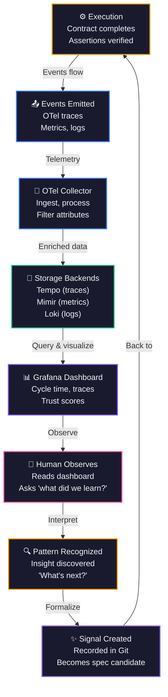

# Task: Create observe.html page — the Observe phase narrative

> Handoff spec for Claude Code terminal. Creates observe.html — a Pillar 2 ("The System") depth page about the Observe phase narrative, explaining how loop closure works and what dashboards reveal.

## Context

The Observe phase is the most powerful concept in the Intent methodology. It closes the loop: execution generates data, observation turns data into understanding, understanding generates new signals. The current site has no dedicated page for this concept. This task creates that page as part of Pillar 2 ("The System").

Read `site-ia.md` and `site-spec.md` before starting. This page belongs in Pillar 2 alongside flow-diagram.html, system-diagram.html, schemas.html, signals.html, dogfood.html. Follow the CSS strategy (shared styles.css + page-specific `<style>` block). Reference the observability-page.md and system-diagram-page.md tasks for Pillar 2 page structure patterns.

**CRITICAL: Update the Pillar 2 sub-nav on ALL Pillar 2 pages to include "Observe" and "Start" (Getting Started) links.** This page must be discoverable from every Pillar 2 page.

## Page: `docs/observe.html` — NEW

### Nav Configuration

**Primary nav:** "The System" active
**Sub-nav:** Pillar 2 sub-nav with "Observe" active

Updated Pillar 2 sub-nav (apply to ALL Pillar 2 pages):

```html
<nav class="site-nav">
  <a href="index.html" class="logo"><span>I</span>ntent</a>
  <a href="pitch.html">The Story</a>
  <a href="work-system.html" class="active">The System</a>
  <a href="architecture.html">The Build</a>
</nav>

<nav class="sub-nav">
  <a href="work-system.html">Overview</a>
  <a href="flow-diagram.html">Flow</a>
  <a href="system-diagram.html">System Map</a>
  <a href="schemas.html">Schemas</a>
  <a href="signals.html">Signals</a>
  <a href="dogfood.html">Dogfood</a>
  <a href="observe.html" class="active">Observe</a>
  <a href="event-catalog.html">Events</a>
  <a href="getting-started.html">Start</a>
</nav>
```

**IMPORTANT: Update sub-nav on these Pillar 2 pages:**
- work-system.html
- flow-diagram.html
- system-diagram.html
- schemas.html
- signals.html
- dogfood.html
- event-catalog.html
- getting-started.html (when created)

Each page keeps its own link as `class="active"`.

### Page Structure

```
┌──────────────────────────────────────────┐
│ Primary Nav (The System active)          │
│ Sub-Nav (Observe active)                 │
├──────────────────────────────────────────┤
│ HERO                                     │
│ Title: Observe                           │
│ Kicker: CLOSING THE LOOP                 │
│ Subtitle: Every execution generates      │
│           data. Observation turns        │
│           data into understanding.       │
│           Understanding generates       │
│           new signals.                   │
├──────────────────────────────────────────┤
│ WHAT OBSERVATION MEANS                   │
│ (narrative section)                      │
├──────────────────────────────────────────┤
│ THE LOOP CLOSURE MECHANISM                │
│ (Mermaid diagram)                        │
│ Execution → OTel → Grafana → Human       │
│ reads → Notices something → New signal   │
├──────────────────────────────────────────┤
│ WHAT THE DASHBOARD REVEALS                │
│ (5 question cards)                       │
├──────────────────────────────────────────┤
│ FROM OBSERVATION TO NEW SIGNALS           │
│ (concrete loop-closure examples)         │
├──────────────────────────────────────────┤
│ CROSS-LINKS                              │
│ (See observability.html, dogfood.html,   │
│  signals.html)                           │
├──────────────────────────────────────────┤
│ Footer                                   │
└──────────────────────────────────────────┘
```

### Section 1: Hero

```html
<header class="page-header">
    <div class="container">
        <p class="header-kicker">Closing the Loop</p>
        <h1>Observe</h1>
        <p class="subtitle">
            Every execution generates data. Observation turns data into understanding. Understanding generates new signals.
        </p>
    </div>
</header>
```

### Section 2: What Observation Means

A narrative section contrasting traditional monitoring (is it up?) with Intent observation (did it work? did it improve? what's next?).

Key points:
- Observation is not just metrics. Not just "is the system up?"
- Observation is the act of looking at what happened and asking "what did we learn?"
- Traditional APM/monitoring (Is it up? Is it fast? Are there errors?) answers operational questions.
- Intent observation answers product/learning questions: Did the execution work? Did it improve the signal? What does this outcome mean for the next spec?

Example: Imagine you executed a spec to "improve signal capture latency from 5s to 2s". You observe that:
- Actual latency is now 1.8s (exceeded the goal)
- New signal count increased 40% (signals were previously missed due to latency)
- Cost per signal decreased 20% (better infrastructure utilization)
- One team member manually identified a pattern in the new signals: "most missed signals come from high-frequency sensors"

The observation reveals not just that the spec worked, but WHY and WHAT IT UNLOCKS. That insight becomes the next signal: "cluster high-frequency sensors separately".

### Section 3: The Loop Closure Mechanism

A Mermaid diagram showing the feedback loop:

```
Execution (contract completed)
    ↓
Events emitted (OTel trace, metrics, logs)
    ↓
OTel Collector (ingestion, processing)
    ↓
Grafana (Tempo + Mimir + Loki storage)
    ↓
Grafana Dashboard (signal.captured → contract.completed timeline, trust scores, patterns)
    ↓
Human reads dashboard
    ↓
Human notices a pattern or outcome
    ↓
New signal created (recorded in Git)
    ↓
[Loop continues]
```

**Colors:** Use Intent persona colors (amber for human, blue for system, green for observation, purple for signal).

The diagram title: "Loop Closure: From Execution to Understanding to Intent"

**Mermaid source file:** `docs/diagrams/loop-closure.mermaid`

Include this HTML block and link to the source file per Mermaid Source Link Policy (see memory index):

```html
<div class="diagram-container">
    <div class="mermaid">
        <!-- Mermaid source here -->
    </div>
    <p class="diagram-source">
        <a href="diagrams/loop-closure.mermaid">Source: loop-closure.mermaid</a>
    </p>
</div>
```

### Section 4: What the Dashboard Reveals (5 Question Cards)

Five dashboard insight cards, each addressing a key observation question. Layout: 2-column grid on desktop, single column on mobile.

#### Card 1: "How long does it take?"

**Visual:** A histogram showing signal.captured → contract.completed cycle time (in seconds). X-axis is time buckets (0–1s, 1–5s, 5–10s, etc.), Y-axis is frequency (signal count).

**Narrative:** "Cycle time tells you whether specs execute as fast as expected. Look for patterns: Are most specs clustered around 5 seconds? Do some outliers take 60+ seconds? This histogram reveals where optimization opportunities lie. A shift in the distribution (previously 10s, now 2s) shows that your observation led to improvement."

#### Card 2: "Where do signals come from?"

**Visual:** A pie/donut chart showing signal source distribution across 5 tiers:
- Tier 1: Human notice (manual observations, meeting notes)
- Tier 2: Execution events (from running specs)
- Tier 3: Clustering (automated grouping of similar events)
- Tier 4: Feedback loop (observations of previous observations)
- Tier 5: External (third-party signals, system integration)

**Narrative:** "Signals come from many places. A healthy system has diversity: manual human insights, automated event clustering, and refined feedback loops. If 95% of signals are manual, automation is missing. If 0% are manual, you've lost human judgment. This distribution tells you whether your observation mechanisms are balanced."

#### Card 3: "How much can agents do alone?"

**Visual:** A bar chart showing trust score distribution across L0–L4:
- L0: No autonomy (human review required)
- L1: Simple routing (agent can decide)
- L2: Guided decisions (agent can act with templates)
- L3: Complex execution (agent can interpret specs)
- L4: Full autonomy (agent can identify new opportunities)

**Narrative:** "Trust scores reveal agent capability. Most specs start at L1–L2 (safe, simple). As agents prove themselves through execution, they progress to L3–L4 (complex reasoning, opportunity identification). The distribution shows where your agents are operating. Moving right = increasing trust. Regression = something broke."

#### Card 4: "What's failing?"

**Visual:** A pass/fail rate card showing contract assertion results:
- Green: Contract assertions passed (spec executed as intended)
- Red: Contract assertions failed (spec did not meet its own definition of success)
- Gray: Contract in progress (still executing)

**Narrative:** "Contracts define success explicitly. Every spec includes assertions (e.g., 'signal count > 1000', 'latency < 2s'). When a contract fails, observation must ask: Why? Was the spec wrong? Was the environment different? Is the assertion too strict? Failed contracts are learning opportunities, not failures."

#### Card 5: "What patterns are emerging?"

**Visual:** A time-series chart showing signal clustering trends:
- X-axis: time (days/weeks)
- Y-axis: number of distinct signal clusters
- Color bands: major cluster themes (infrastructure, process, capacity, discovery)

**Narrative:** "Patterns emerge over time. One week, all signals cluster around 'latency'. The next week, a new cluster emerges: 'trust score plateau'. This chart reveals what the system is learning about itself. Growing cluster count = increasing observational sophistication. Stable count = reaching plateau. Declining count = possibly overfitting."

---

### Section 5: From Observation to New Signals

Concrete, real-world examples of loop closure. Format: narrative + concrete spec→outcome→signal chain.

#### Example 1: Latency → Infrastructure Specification

```
OBSERVATION: Spec to improve signal capture latency was executed.
Latency dropped from 5s to 1.8s (goal was 2s).

INSIGHT: New signals were now captured that were previously timing out.
The dashboard revealed a distribution shift: formerly 30% of signals
timed out, now <5%.

SIGNAL CREATED: "Most missed signals come from high-frequency IoT sensors
(>100 Hz). These sensors timeout on the global message queue during peak
hours. Proposed infrastructure solution: dedicated queue for high-frequency
streams."

NEXT SPEC: Infrastructure-spec.md — provision a separate Kafka topic for
high-frequency signals, implement sensor-type routing logic.
```

#### Example 2: Trust → Autonomy Evolution

```
OBSERVATION: Agent executing a spec to "refactor signal schema" completed
successfully. Contract assertion passed (backward compatibility maintained).

INSIGHT: Dashboard trust score increased from L2 (guided) to L3 (complex).
The agent had to make 5 schema decisions on the fly; all were validated
post-execution.

SIGNAL CREATED: "Agent is ready for L3 autonomy on schema-related specs.
Trust score trending upward. Consider delegating spec interpretation to
this agent."

NEXT SPEC: Agent-autonomy-spec.md — update agent routing rules to assign
schema-related specs directly to this agent without human review.
```

#### Example 3: Cost → Optimization Opportunity

```
OBSERVATION: Dashboard reveals per-execution cost has increased 40% over
two weeks. Root cause visible in metrics: Claude API token usage grew
(more Opus calls than Haiku calls).

INSIGHT: Agent is over-specifying complexity. Simpler specs are being
routed to Opus when Haiku would suffice.

SIGNAL CREATED: "Agent prompt for complexity classification is too
conservative. False positives on 'complex' decisions are wasting budget.
Proposed refinement: add example signal clusters to the prompt to improve
classification accuracy."

NEXT SPEC: Prompt-refinement-spec.md — iterate agent system prompt with
specific examples, measure reduction in Opus over-allocation.
```

---

### Section 6: Cross-Links

At the bottom of the page, include a "Related Pages" section linking to:

- **observability.html** — "See the OTel stack architecture that powers observation"
- **dogfood.html** — "See live observations of Intent building Intent"
- **signals.html** — "See how observations become new signals"
- **work-system.html** — "See the dashboard in action"

Format as a three-column card grid:

```html
<section class="related-pages">
    <h2>Related Pages</h2>
    <div class="card-grid">
        <a href="observability.html" class="card">
            <h3>Observability Stack</h3>
            <p>See the OTel stack architecture that powers observation. Traces, metrics, logs, and how they flow from execution to dashboard.</p>
        </a>
        <a href="dogfood.html" class="card">
            <h3>Dogfood</h3>
            <p>See live observations of Intent building Intent. Watch the loop in action: signals → specs → execution → observation → new signals.</p>
        </a>
        <a href="signals.html" class="card">
            <h3>Signals</h3>
            <p>See how observations become new signals. Live signal stream showing trust scores, clustering, and pattern detection.</p>
        </a>
    </div>
</section>
```

---

### Mermaid Diagram Specification

Create `docs/diagrams/loop-closure.mermaid`:



**Color scheme:**
- Execute (amber) = Practitioner-Architect (△)
- Events (blue) = Product-Minded Leader (◇)
- Collector (blue) = Product-Minded Leader (◇)
- Storage (green) = AI Agent (◉)
- Dashboard (purple) = Design-Quality Advocate (○)
- Human (pink) = Practitioner-Architect (△)
- Pattern (amber) = Practitioner-Architect (△)
- Signal (purple) = Design-Quality Advocate (○)

---

## HTML Template Structure

```html
<!DOCTYPE html>
<html lang="en">
<head>
    <meta charset="UTF-8">
    <meta name="viewport" content="width=device-width, initial-scale=1.0">
    <title>Observe - Intent</title>
    <link rel="stylesheet" href="styles.css">
    <script src="https://cdnjs.cloudflare.com/ajax/libs/mermaid/10.9.1/mermaid.min.js"></script>
    <script>
        mermaid.initialize({
            startOnLoad: true,
            theme: 'dark',
            themeVariables: {
                primaryColor: '#1e293b',
                primaryTextColor: '#f1f5f9',
                primaryBorderColor: '#334155',
                lineColor: '#64748b',
                secondaryColor: '#0f172a',
                tertiaryColor: '#1e293b',
                fontFamily: 'Inter, system-ui, sans-serif'
            }
        });
    </script>
    <style>
        /* Page-specific styling */
        .header-kicker {
            color: #f59e0b;
            font-size: 0.875rem;
            font-weight: 600;
            text-transform: uppercase;
            letter-spacing: 0.05em;
            margin-bottom: 0.5rem;
        }

        .subtitle {
            font-size: 1.25rem;
            line-height: 1.6;
            color: #cbd5e1;
            margin-top: 1rem;
            max-width: 600px;
        }

        .section-intro {
            font-size: 1.125rem;
            line-height: 1.7;
            color: #e2e8f0;
            margin-bottom: 2rem;
        }

        .narrative-section {
            margin: 3rem 0;
        }

        .narrative-section h2 {
            font-size: 1.75rem;
            font-weight: 700;
            color: #f1f5f9;
            margin-bottom: 1.5rem;
        }

        .narrative-section p {
            color: #cbd5e1;
            line-height: 1.8;
            margin-bottom: 1.5rem;
            font-size: 1.0625rem;
        }

        .example-block {
            background: #0f172a;
            border-left: 3px solid #f59e0b;
            padding: 1.5rem;
            margin: 2rem 0;
            border-radius: 0.25rem;
        }

        .example-block strong {
            color: #fbbf24;
            display: block;
            margin-bottom: 0.5rem;
            text-transform: uppercase;
            font-size: 0.875rem;
        }

        .example-block p {
            color: #cbd5e1;
            line-height: 1.7;
            margin: 0.5rem 0;
        }

        .diagram-container {
            margin: 3rem 0;
            background: #0f172a;
            padding: 2rem;
            border-radius: 0.5rem;
            border: 1px solid #334155;
        }

        .mermaid {
            display: flex;
            justify-content: center;
        }

        .diagram-source {
            text-align: center;
            color: #94a3b8;
            font-size: 0.875rem;
            margin-top: 1rem;
        }

        .diagram-source a {
            color: #60a5fa;
            text-decoration: none;
        }

        .diagram-source a:hover {
            text-decoration: underline;
        }

        .insight-card {
            background: linear-gradient(135deg, #1e293b 0%, #0f172a 100%);
            border: 1px solid #334155;
            border-radius: 0.5rem;
            padding: 1.5rem;
            margin-bottom: 1.5rem;
        }

        .insight-card h3 {
            color: #f1f5f9;
            font-size: 1.25rem;
            font-weight: 600;
            margin: 0 0 0.5rem 0;
        }

        .insight-card .visual-hint {
            color: #60a5fa;
            font-size: 0.875rem;
            font-weight: 600;
            text-transform: uppercase;
            margin-bottom: 1rem;
        }

        .insight-card p {
            color: #cbd5e1;
            line-height: 1.7;
            margin: 0.5rem 0;
        }

        .insights-grid {
            display: grid;
            grid-template-columns: repeat(auto-fit, minmax(300px, 1fr));
            gap: 2rem;
            margin: 2rem 0;
        }

        .related-pages {
            margin-top: 4rem;
            padding-top: 2rem;
            border-top: 1px solid #334155;
        }

        .related-pages h2 {
            font-size: 1.5rem;
            color: #f1f5f9;
            margin-bottom: 2rem;
        }

        .card-grid {
            display: grid;
            grid-template-columns: repeat(auto-fit, minmax(280px, 1fr));
            gap: 2rem;
        }

        .card {
            background: linear-gradient(135deg, #1e293b 0%, #0f172a 100%);
            border: 1px solid #334155;
            border-radius: 0.5rem;
            padding: 2rem;
            text-decoration: none;
            transition: all 0.3s ease;
        }

        .card:hover {
            border-color: #60a5fa;
            box-shadow: 0 4px 12px rgba(96, 165, 250, 0.2);
        }

        .card h3 {
            color: #f1f5f9;
            font-size: 1.25rem;
            margin: 0 0 1rem 0;
        }

        .card p {
            color: #cbd5e1;
            line-height: 1.6;
            margin: 0;
        }
    </style>
</head>
<body>
    <nav class="site-nav">
        <a href="index.html" class="logo"><span>I</span>ntent</a>
        <a href="pitch.html">The Story</a>
        <a href="work-system.html" class="active">The System</a>
        <a href="architecture.html">The Build</a>
    </nav>

    <nav class="sub-nav">
        <a href="work-system.html">Overview</a>
        <a href="flow-diagram.html">Flow</a>
        <a href="system-diagram.html">System Map</a>
        <a href="schemas.html">Schemas</a>
        <a href="signals.html">Signals</a>
        <a href="dogfood.html">Dogfood</a>
        <a href="observe.html" class="active">Observe</a>
        <a href="event-catalog.html">Events</a>
        <a href="getting-started.html">Start</a>
    </nav>

    <header class="page-header">
        <div class="container">
            <p class="header-kicker">Closing the Loop</p>
            <h1>Observe</h1>
            <p class="subtitle">
                Every execution generates data. Observation turns data into understanding. Understanding generates new signals.
            </p>
        </div>
    </header>

    <main class="container">

        <!-- SECTION 1: What Observation Means -->
        <section class="narrative-section">
            <h2>What Observation Means</h2>
            <p>
                Observation is not just monitoring. Not "is the system up?" or "is it fast enough?" Observation is the act of looking at what happened and asking: "what did we learn? what does this outcome mean? what should we do next?"
            </p>
            <p>
                Traditional application performance monitoring (APM) and observability tools answer operational questions:
            </p>
            <ul>
                <li>Is the system up?</li>
                <li>Is latency within SLA?</li>
                <li>Are there errors?</li>
            </ul>
            <p>
                Intent observation answers product and learning questions:
            </p>
            <ul>
                <li>Did the execution work as intended?</li>
                <li>Did it improve the signal?</li>
                <li>What does this outcome reveal about our next step?</li>
            </ul>
            <p>
                Here's a concrete example. Imagine you executed a spec to "improve signal capture latency from 5 seconds to 2 seconds." You observe that:
            </p>
            <div class="example-block">
                <strong>Observation Example: Latency Improvement</strong>
                <p><strong>What happened:</strong> Actual latency is now 1.8 seconds (exceeded the 2-second goal).</p>
                <p><strong>The deeper insight:</strong> New signal count increased 40%. Signals that previously timed out are now being captured. Cost per signal decreased 20% — better infrastructure utilization.</p>
                <p><strong>The learning:</strong> One team member notices a pattern in the new signals: "most of the previously missed signals come from high-frequency sensors (>100 Hz) that were timing out during peak hours."</p>
                <p><strong>The next signal:</strong> "High-frequency sensors need dedicated infrastructure. Propose a separate message queue tier for sensors >100 Hz."</p>
            </div>
            <p>
                The observation reveals not just that the spec worked (latency target met), but WHY it mattered (new signals unlocked) and WHAT IT ENABLES (optimization opportunity). That insight becomes the next signal in the queue.
            </p>
        </section>

        <!-- SECTION 2: The Loop Closure Mechanism -->
        <section class="narrative-section">
            <h2>The Loop Closure Mechanism</h2>
            <p>
                Observation closes the feedback loop. Here's how data becomes understanding:
            </p>

            <div class="diagram-container">
                <div class="mermaid">
graph TB
    Execute["⚙️ Execution<br/>Contract completes<br/>Assertions verified"]
    Events["📤 Events Emitted<br/>OTel traces<br/>Metrics, logs"]
    Collector["🔄 OTel Collector<br/>Ingest, process<br/>Filter attributes"]
    Storage["💾 Storage Backends<br/>Tempo traces<br/>Mimir metrics<br/>Loki logs"]
    Dashboard["📊 Grafana Dashboard<br/>Cycle time, traces<br/>Trust scores"]
    Human["👤 Human Observes<br/>Reads dashboard<br/>Asks 'what did we learn?'"]
    Pattern["🔍 Pattern Recognized<br/>Insight discovered<br/>'What's next?'"]
    Signal["✨ Signal Created<br/>Recorded in Git<br/>Becomes spec candidate"]

    Execute -->|"Events flow"| Events
    Events -->|"Telemetry"| Collector
    Collector -->|"Enriched data"| Storage
    Storage -->|"Query & visualize"| Dashboard
    Dashboard -->|"Observe"| Human
    Human -->|"Interpret"| Pattern
    Pattern -->|"Formalize"| Signal
    Signal -->|"Back to"| Execute

    style Execute fill:#1a1a2e,stroke:#f59e0b,stroke-width:2px,color:#f1f5f9
    style Events fill:#1a1a2e,stroke:#3b82f6,stroke-width:2px,color:#f1f5f9
    style Collector fill:#1a1a2e,stroke:#3b82f6,stroke-width:2px,color:#f1f5f9
    style Storage fill:#1a1a2e,stroke:#10b981,stroke-width:2px,color:#f1f5f9
    style Dashboard fill:#1a1a2e,stroke:#8b5cf6,stroke-width:2px,color:#f1f5f9
    style Human fill:#1a1a2e,stroke:#ec4899,stroke-width:2px,color:#f1f5f9
    style Pattern fill:#1a1a2e,stroke:#f59e0b,stroke-width:2px,color:#f1f5f9
    style Signal fill:#1a1a2e,stroke:#8b5cf6,stroke-width:2px,color:#f1f5f9
                </div>
                <p class="diagram-source">
                    <a href="diagrams/loop-closure.mermaid">Source: loop-closure.mermaid</a>
                </p>
            </div>

            <p>
                The loop is mechanical but the insight is human. Execution is deterministic (the spec runs or it doesn't). Events flow automatically (OTel traces). Storage scales (Grafana Tempo, Mimir, Loki). But observation—the moment a human reads the dashboard and thinks "aha, I see the pattern"—that's where value is created.
            </p>
        </section>

        <!-- SECTION 3: What the Dashboard Reveals -->
        <section class="narrative-section">
            <h2>What the Dashboard Reveals</h2>
            <p>
                The Observe dashboard answers five critical questions about system health, agent capability, and learning patterns:
            </p>

            <div class="insights-grid">
                <div class="insight-card">
                    <h3>"How long does it take?"</h3>
                    <p class="visual-hint">Cycle Time Histogram</p>
                    <p>
                        Cycle time is signal.captured → contract.completed. The histogram shows you the distribution: are most specs clustered around 5 seconds? Do some outliers take 60+ seconds? A shift in the distribution (previously 10s, now 2s) shows that your observation led to improvement.
                    </p>
                </div>

                <div class="insight-card">
                    <h3>"Where do signals come from?"</h3>
                    <p class="visual-hint">Source Distribution Pie Chart</p>
                    <p>
                        Signals originate from five tiers: manual human observation, execution events, automated clustering, feedback loop signals, and external integrations. A healthy system has diversity. 95% manual = automation missing. 0% manual = lost human judgment.
                    </p>
                </div>

                <div class="insight-card">
                    <h3>"How much can agents do alone?"</h3>
                    <p class="visual-hint">Trust Score Distribution (L0–L4)</p>
                    <p>
                        Trust scores reveal agent capability across five autonomy levels. Most specs start at L1–L2 (safe, simple). As agents prove themselves through execution, they progress to L3–L4 (complex reasoning). Moving right = increasing trust. Regression = something broke.
                    </p>
                </div>

                <div class="insight-card">
                    <h3>"What's failing?"</h3>
                    <p class="visual-hint">Contract Assertion Pass/Fail Rate</p>
                    <p>
                        Contracts define success explicitly. Every spec includes assertions (e.g., "signal count > 1000", "latency < 2s"). When a contract fails, observation must ask: Why? Was the spec wrong? Was the environment different? Failed contracts are learning opportunities.
                    </p>
                </div>

                <div class="insight-card">
                    <h3>"What patterns are emerging?"</h3>
                    <p class="visual-hint">Signal Clustering Trends</p>
                    <p>
                        Patterns emerge over time. One week, all signals cluster around "latency". The next week, a new cluster emerges: "trust score plateau". Growing cluster count = increasing observational sophistication. Stable count = reaching plateau. Declining count = possibly overfitting.
                    </p>
                </div>
            </div>
        </section>

        <!-- SECTION 4: From Observation to New Signals -->
        <section class="narrative-section">
            <h2>From Observation to New Signals</h2>
            <p>
                Here are concrete examples of how observation closes the loop: execution outcome → insight → new signal → next spec.
            </p>

            <div class="example-block">
                <strong>Example 1: Latency Observation → Infrastructure Signal</strong>
                <p><strong>Execution:</strong> Spec to improve signal capture latency was executed. Latency dropped from 5s to 1.8s (goal was 2s).</p>
                <p><strong>Observation:</strong> New signals were captured that previously timed out. Dashboard revealed a distribution shift: formerly 30% of signals timed out, now <5%.</p>
                <p><strong>Insight:</strong> "Most missed signals come from high-frequency IoT sensors (>100 Hz). These sensors timeout on the global message queue during peak hours."</p>
                <p><strong>Signal Created:</strong> "Propose infrastructure solution: dedicated queue for high-frequency streams."</p>
                <p><strong>Next Spec:</strong> infrastructure-spec.md — provision a separate Kafka topic for high-frequency signals, implement sensor-type routing logic.</p>
            </div>

            <div class="example-block">
                <strong>Example 2: Agent Execution → Autonomy Signal</strong>
                <p><strong>Execution:</strong> Agent executing a spec to "refactor signal schema" completed successfully. Contract assertion passed (backward compatibility maintained).</p>
                <p><strong>Observation:</strong> Dashboard trust score increased from L2 (guided) to L3 (complex). The agent had to make 5 schema decisions on the fly; all were validated post-execution.</p>
                <p><strong>Insight:</strong> "Agent is ready for L3 autonomy on schema-related specs. Trust score trending upward."</p>
                <p><strong>Signal Created:</strong> "Consider delegating spec interpretation to this agent."</p>
                <p><strong>Next Spec:</strong> agent-autonomy-spec.md — update agent routing rules to assign schema-related specs directly to this agent without human review.</p>
            </div>

            <div class="example-block">
                <strong>Example 3: Cost Observation → Optimization Signal</strong>
                <p><strong>Execution:</strong> Dashboard reveals per-execution cost has increased 40% over two weeks. Root cause visible in metrics: Claude API token usage grew (more Opus calls than Haiku calls).</p>
                <p><strong>Observation:</strong> Agent is over-specifying complexity. Simpler specs are being routed to Opus when Haiku would suffice.</p>
                <p><strong>Insight:</strong> "Agent prompt for complexity classification is too conservative. False positives on 'complex' decisions are wasting budget."</p>
                <p><strong>Signal Created:</strong> "Propose refinement: add example signal clusters to the prompt to improve classification accuracy."</p>
                <p><strong>Next Spec:</strong> prompt-refinement-spec.md — iterate agent system prompt with specific examples, measure reduction in Opus over-allocation.</p>
            </div>
        </section>

        <!-- SECTION 5: Cross-Links -->
        <section class="related-pages">
            <h2>Related Pages</h2>
            <div class="card-grid">
                <a href="observability.html" class="card">
                    <h3>Observability Stack</h3>
                    <p>See the OTel stack architecture that powers observation. Traces, metrics, logs, and how they flow from execution to dashboard.</p>
                </a>
                <a href="dogfood.html" class="card">
                    <h3>Dogfood</h3>
                    <p>See live observations of Intent building Intent. Watch the loop in action: signals → specs → execution → observation → new signals.</p>
                </a>
                <a href="signals.html" class="card">
                    <h3>Signals</h3>
                    <p>See how observations become new signals. Live signal stream showing trust scores, clustering, and pattern detection.</p>
                </a>
            </div>
        </section>

    </main>

    <footer>
        <div class="container">
            <p>Source: <a href="https://github.com/theparlor/intent">github.com/theparlor/intent</a> · Built with the Intent methodology</p>
        </div>
    </footer>
</body>
</html>
```

### Critical Updates: Pillar 2 Sub-Nav

After creating observe.html, update the Pillar 2 sub-nav on these pages:
- work-system.html
- flow-diagram.html
- system-diagram.html
- schemas.html
- signals.html
- dogfood.html
- event-catalog.html
- getting-started.html (when created)

Replace the old sub-nav with the new one (add "Observe" and "Start" links):

```html
<nav class="sub-nav">
  <a href="work-system.html">Overview</a>
  <a href="flow-diagram.html">Flow</a>
  <a href="system-diagram.html">System Map</a>
  <a href="schemas.html">Schemas</a>
  <a href="signals.html">Signals</a>
  <a href="dogfood.html">Dogfood</a>
  <a href="observe.html">Observe</a>
  <a href="event-catalog.html">Events</a>
  <a href="getting-started.html">Start</a>
</nav>
```

### Files to Create/Modify

**Create:**
- `docs/observe.html` — main page (12KB+)
- `docs/diagrams/loop-closure.mermaid` — Mermaid source file

**Modify (update sub-nav):**
- `docs/work-system.html`
- `docs/flow-diagram.html`
- `docs/system-diagram.html`
- `docs/schemas.html`
- `docs/signals.html`
- `docs/dogfood.html`
- `docs/event-catalog.html`
- `docs/getting-started.html` (when created)

### Verification Checklist

- [ ] observe.html renders cleanly in browser (mobile responsive)
- [ ] Navigation is correct: "The System" primary nav active, "Observe" sub-nav active
- [ ] Mermaid diagram renders correctly (no CDN errors in console)
- [ ] All five insight cards are visible and readable
- [ ] Cross-links to observability.html, dogfood.html, signals.html are working
- [ ] loop-closure.mermaid file exists and is linked correctly
- [ ] Page is approximately 12KB+ (verify with Chrome DevTools Network tab)
- [ ] CSS styling matches site aesthetic (consistent with work-system.html, system-diagram.html)
- [ ] No console errors (open DevTools console, refresh, verify clean)
- [ ] All Pillar 2 pages have updated sub-nav with "Observe" and "Start" links

### Commit Block

```
commit: Create observe.html — the Observe phase narrative

This commit creates observe.html, a Pillar 2 ("The System") depth page
explaining the Observe phase: how loop closure works, what dashboards
reveal, and how observations become new signals.

Sections:
1. What Observation Means — contrasts APM monitoring with Intent
   observation (data → understanding → action)
2. The Loop Closure Mechanism — Mermaid diagram showing execution → events
   → storage → dashboard → human insight → new signal
3. What the Dashboard Reveals — 5 questions: cycle time, signal sources,
   agent autonomy, contract failures, emerging patterns
4. From Observation to New Signals — 3 concrete examples (latency →
   infrastructure, execution → autonomy, cost → optimization)
5. Cross-links to observability.html, dogfood.html, signals.html

Also creates docs/diagrams/loop-closure.mermaid with full diagram source.

CRITICAL: Updates Pillar 2 sub-nav on ALL Pillar 2 pages to include
"Observe" and "Start" (getting-started.html) links per Mermaid Source
Link Policy.

Task spec: tasks/observe-page.md
Verified: navigation, Mermaid rendering, cross-links, page weight, CSS
consistency, sub-nav updates on all Pillar 2 pages
```

---

## Summary

Both task specs are now written and ready for Claude Code terminal execution:

1. **expand-decisions.md** — Expands decisions.html stub to full Rich page with 6 complete ADR entries (D1–D6). 10KB+ of substantive architectural decision records.

2. **observe-page.md** — Creates observe.html, the Observe phase narrative page for Pillar 2. 12KB+ with Mermaid diagram, 5 insight cards, concrete examples, and cross-links. Includes critical navigation updates for all Pillar 2 pages.

Both files follow the established pattern (site-ia.md, site-spec.md) and reference prior task specs (observability-page.md, system-diagram-page.md) for consistency. All verification checklists and commit blocks are included.
