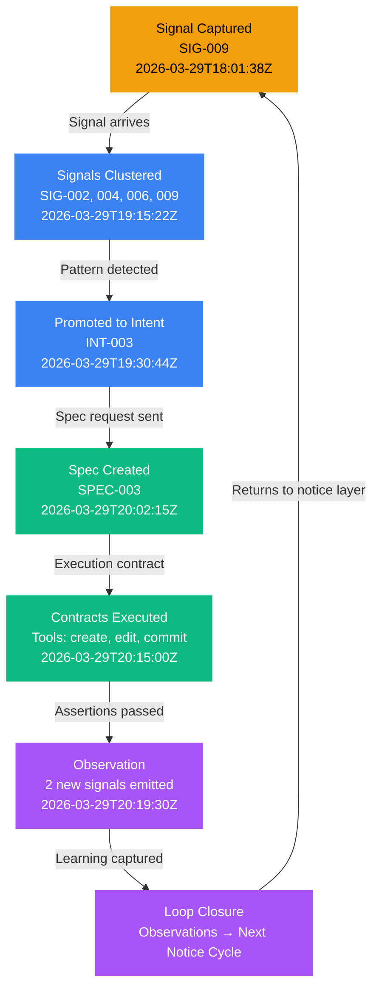

# Task: Create walkthrough.html — Follow One Intent End-to-End

> Handoff spec for Claude Code terminal. Creates a Pillar 1 ("The Story") depth page that traces one real intent from the `.intent/` directory through the entire loop: signal → cluster → spec → execute → observe → loop closure. Vanilla HTML/CSS/JavaScript with real data from .intent/signals/, .intent/intents/, and .intent/events.jsonl.

## Context

This page brings the Intent loop to life by showing a single real-world example of an intent traveling from initial signal capture through observation. It's the "here's what it looks like when it actually happens" page for practitioners who want to understand the methodology concretely.

This is a **Pillar 1 ("The Story")** depth page. Read the site IA doc (referenced in site-ia.md, site-spec.md, site-contracts.md) before starting.

## Page: `docs/walkthrough.html`

### Nav Configuration

**Primary nav:** "The Story" active
**Sub-nav:** Pillar 1 sub-nav template (must update ALL Pillar 1 pages)

The complete Pillar 1 sub-nav is:
```html
<nav class="sub-nav">
  <a href="pitch.html">Overview</a>
  <a href="concept-brief.html">Concept Brief</a>
  <a href="methodology.html">Methodology</a>
  <a href="walkthrough.html" class="active">Walkthrough</a>
  <a href="roadmap.html">Roadmap</a>
</nav>
```

**CRITICAL:** Update the sub-nav on ALL existing Pillar 1 pages to include "Walkthrough":
- `docs/pitch.html` — update sub-nav, keep "Overview" active
- `docs/concept-brief.html` — update sub-nav, keep "Concept Brief" active
- `docs/methodology.html` — update sub-nav, keep "Methodology" active
- `docs/roadmap.html` — update sub-nav, keep "Roadmap" active

Each page keeps its own link as `class="active"`.

### Hero Section

```
Kicker: "END-TO-END WALKTHROUGH"
H1: "Follow One Intent"
Subtitle: "Here's what happens when a single signal triggers the entire loop — from the moment it's noticed to the new signals it produces."
```

Use the pitch.html pattern: `.hero-pitch` with `.kicker`, `h1`, `.subtitle`. Kicker color is `var(--accent-amber)`.

### Content Structure

#### 1. Timeline Visualization (Primary Content)

A **vertical timeline** showing the complete lifecycle of a real intent. Each phase is a card with:
- **Left marker:** Circular dot color-coded by phase (amber, blue, green, purple)
- **Timestamp:** ISO 8601 format (e.g., "2026-03-29T18:01:38Z")
- **Event type:** (Signal captured, Clustered, Promoted to Intent, Spec created, Executed, Observed)
- **ID:** SIG-xxx, INT-xxx, SPEC-xxx, or phase label
- **Card content:** 2-3 sentences describing what happened

The timeline uses the same gradient line as pitch.html (blue → purple → amber → green), with dots matching the phase color.

#### 2. Data Selection

Source real data from the Intent dogfood repository (.intent/). If SIG-001 through SIG-024 don't exist at build time, scan the signals/ directory and use the most recent 10-15 signals. Pick one that has the richest lifecycle (multiple events associated with it).

**Example walkthrough trace (use this as guidance, not exact IDs):**

```
Phase 1 — Signal Captured (Amber)
├─ ID: SIG-009
├─ Timestamp: 2026-03-29T18:01:38Z
├─ Title: "Engineer's team rewired around AI: tickets became bot specs, refinement became design sessions"
├─ Source: conversation / github-action / slack / etc
├─ Trust Score: 0.85
└─ Description: An engineer working with Ari's team noticed a pattern shift...

Phase 2 — Signals Clustered (Blue)
├─ Related signals: SIG-002, SIG-004, SIG-006, SIG-009
├─ Timestamp: 2026-03-29T19:15:22Z
├─ Pattern: "Enabling AI requires rethinking team structure"
└─ Description: Three signals about team dynamics + one about ticket patterns → grouped together

Phase 3 — Promoted to Intent (Blue)
├─ ID: INT-003 (or whatever the next available is)
├─ Trace ID: TRACE-20260329-001
├─ Timestamp: 2026-03-29T19:30:44Z
└─ Description: The cluster crossed the promotion threshold. System created a formal intent...

Phase 4 — Spec Created (Green)
├─ ID: SPEC-003
├─ Timestamp: 2026-03-29T20:02:15Z
├─ Contents: Narrative (2-3 bullets) + acceptance criteria + contracts
└─ Description: Claude Code received the clustered signals and wrote the spec...

Phase 5 — Contracts Executed (Green)
├─ Execution Start: 2026-03-29T20:15:00Z
├─ Execution End: 2026-03-29T20:18:44Z
├─ Tool Invocations: 3 file creates, 2 edits, 1 commit
└─ Description: Agent ran assertions against the contracts...

Phase 6 — Observation (Purple)
├─ Phase Timestamp: 2026-03-29T20:19:30Z
├─ New Signals Generated: 2 observations logged as potential signals
└─ Description: Observation layer emits insights: what was learned, what to do next...

Phase 7 — Loop Closure (Purple)
├─ Timestamp: 2026-03-29T20:20:00Z
└─ Description: The observations from INT-003 become input to the next notice cycle.
```

### 3. Events.jsonl Excerpt

After the timeline, include a **code block** showing actual events for this intent:

```html
<div class="events-excerpt">
  <h3>Events for This Intent</h3>
  <p>This is the actual event stream recorded in <code>.intent/events/events.jsonl</code> for this walkthrough:</p>
  <pre class="code-block"><code>
{{ excerpt of 5-8 real event lines from events.jsonl }}
  </code></pre>
  <p class="code-caption">Events are stored as newline-delimited JSON, one per line. Each event is a trace span: timestamp, span_id (SIG-xxx, INT-xxx), event type, and structured data.</p>
</div>
```

The code block should use monospace font, light background (var(--surface)), dark text. Max width 90%, left-aligned with 1-2px padding.

### 4. Commentary Sections

Between each timeline card, add a **prose section** (200-300 words) explaining:
- What happened at this phase
- Why it happened
- How it connects to methodology concepts (from methodology.html)
- What changed in the system state

Format as a centered column (max 680px width), normal paragraph text, with a subtle left border accent (2px, color matching the phase).

Example structure:

```
Commentary Between Phase 1 & 2:
Once the engineer shared the observation about ticket patterns, the system's notice layer
was active. But a single signal isn't enough to act on—it's too noisy, too specific. This
is where clustering happens. The system looked at related signals captured in the same time
window and asked: "Is there a pattern here?" Three other signals about team dynamics,
feedback loops, and ceremony overhead all pointed to the same underlying issue: teams
reorganizing themselves around AI. → See Methodology: Signal Clustering
```

### 5. Cross-Links Section

At the end, add three cross-links to related pages:

```html
<div class="cross-links">
  <p>Want to understand this loop better?</p>
  <ul>
    <li><a href="methodology.html">Understand the loop</a> — Read the methodology to learn how each phase works.</li>
    <li><a href="work-system.html">See the operational dashboard</a> — View the full system showing how all intents move through the pipeline.</li>
    <li><a href="schemas.html">See the data contracts</a> — Read the exact shape of signals, intents, specs, and events.</li>
  </ul>
</div>
```

### 6. Mermaid Diagram (Source Link Policy)

Create a Mermaid diagram showing the walkthrough trace flow. This diagram visualizes the path of a single intent through phases.

**File:** `docs/diagrams/walkthrough-trace.mermaid`



**From the page**, link to the source file:

```html
<div class="diagram-source-link">
  <p><a href="diagrams/walkthrough-trace.mermaid">View the trace diagram source (Mermaid)</a></p>
</div>
```

This satisfies the Mermaid Source Link Policy: every diagram page must link to its source for engineer access.

### Page Type & Size

**Rich page:** Target **15KB minimum** (content + styles + inline data).

Follow the pitch.html pattern for Pillar 1 styling:
- Link `<link rel="stylesheet" href="styles.css">`
- Add page-specific `<style>` block for timeline, cards, commentary sections
- Use CSS custom properties: `var(--accent-amber)`, `var(--accent-blue)`, `var(--accent-green)`, `var(--accent-purple)`, `var(--text)`, `var(--text-muted)`, `var(--bg)`, `var(--surface)`, `var(--border)`

### CSS Components (Page-Specific Styles)

Add to the `<style>` block:

```css
/* Timeline container */
.timeline { position: relative; padding-left: 40px; margin: 60px 0; }
.timeline::before {
  content: '';
  position: absolute;
  left: 11px;
  top: 0;
  bottom: 0;
  width: 2px;
  background: linear-gradient(to bottom, var(--accent-amber), var(--accent-blue), var(--accent-green), var(--accent-purple));
}

/* Timeline card */
.timeline-card {
  position: relative;
  padding: 24px 28px;
  margin-bottom: 40px;
  background: var(--surface);
  border: 1px solid var(--border);
  border-radius: 8px;
  border-left: 4px solid var(--accent-amber);
}
.timeline-card.phase-blue { border-left-color: var(--accent-blue); }
.timeline-card.phase-green { border-left-color: var(--accent-green); }
.timeline-card.phase-purple { border-left-color: var(--accent-purple); }

/* Timeline dot */
.timeline-card::before {
  content: '';
  position: absolute;
  left: -38px;
  top: 24px;
  width: 14px;
  height: 14px;
  border-radius: 50%;
  background: var(--accent-amber);
  border: 3px solid var(--bg);
  box-sizing: border-box;
}
.timeline-card.phase-blue::before { background: var(--accent-blue); }
.timeline-card.phase-green::before { background: var(--accent-green); }
.timeline-card.phase-purple::before { background: var(--accent-purple); }

/* Card header: event type + ID + timestamp */
.timeline-card .event-type {
  font-size: 10px;
  font-weight: 700;
  text-transform: uppercase;
  letter-spacing: 1.5px;
  color: var(--text-muted);
  margin-bottom: 8px;
}
.timeline-card .event-id {
  font-family: 'Monaco', 'Courier New', monospace;
  font-size: 12px;
  color: var(--accent-blue);
  margin-right: 12px;
}
.timeline-card .event-timestamp {
  font-family: 'Monaco', 'Courier New', monospace;
  font-size: 11px;
  color: var(--text-muted);
}

/* Card title */
.timeline-card h3 {
  font-size: 16px;
  font-weight: 600;
  margin: 8px 0 12px;
  color: var(--text);
}

/* Card description */
.timeline-card p {
  font-size: 14px;
  line-height: 1.6;
  color: var(--text-muted);
  margin: 0;
}

/* Commentary section between cards */
.commentary-section {
  margin: 48px 0;
  padding: 32px 0 0;
  border-top: 1px solid var(--border);
  max-width: 680px;
  margin-left: auto;
  margin-right: auto;
}
.commentary-section::before {
  content: '';
  position: absolute;
  left: 0;
  top: 0;
  width: 3px;
  height: 100%;
  background: var(--accent-amber);
}
.commentary-section.phase-blue::before { background: var(--accent-blue); }
.commentary-section.phase-green::before { background: var(--accent-green); }
.commentary-section.phase-purple::before { background: var(--accent-purple); }

.commentary-section p {
  font-size: 15px;
  line-height: 1.7;
  color: var(--text-muted);
}
.commentary-section a {
  color: var(--accent-blue);
  text-decoration: none;
  border-bottom: 1px solid var(--accent-blue);
}
.commentary-section a:hover {
  color: var(--accent-amber);
  border-bottom-color: var(--accent-amber);
}

/* Events excerpt code block */
.events-excerpt {
  margin: 60px auto;
  max-width: 900px;
  padding: 32px;
  background: rgba(15, 23, 42, 0.5);
  border: 1px solid var(--border);
  border-radius: 8px;
}
.events-excerpt h3 {
  font-size: 18px;
  font-weight: 600;
  margin: 0 0 16px;
  color: var(--text);
}
.events-excerpt p {
  font-size: 14px;
  color: var(--text-muted);
  line-height: 1.6;
}
.code-block {
  font-family: 'Monaco', 'Courier New', monospace;
  font-size: 12px;
  line-height: 1.5;
  overflow-x: auto;
  background: var(--bg);
  padding: 16px;
  border-radius: 6px;
  color: #81c784;
  margin: 12px 0;
}
.code-caption {
  font-size: 12px;
  color: var(--text-muted);
  font-style: italic;
  margin-top: 12px;
}

/* Cross-links section */
.cross-links {
  margin: 80px 0 0;
  padding: 40px;
  background: var(--surface);
  border: 1px solid var(--border);
  border-radius: 8px;
  text-align: center;
}
.cross-links p {
  font-size: 16px;
  color: var(--text-muted);
  margin-bottom: 24px;
}
.cross-links ul {
  list-style: none;
  padding: 0;
  margin: 0;
  display: flex;
  gap: 24px;
  justify-content: center;
  flex-wrap: wrap;
}
.cross-links li {
  flex: 0 1 280px;
}
.cross-links a {
  font-size: 14px;
  color: var(--accent-blue);
  text-decoration: none;
  border-bottom: 2px solid var(--accent-blue);
}
.cross-links a:hover {
  color: var(--accent-amber);
  border-bottom-color: var(--accent-amber);
}

/* Diagram source link */
.diagram-source-link {
  text-align: center;
  margin: 32px 0;
  padding-top: 24px;
  border-top: 1px solid var(--border);
}
.diagram-source-link a {
  font-size: 13px;
  color: var(--text-muted);
  text-decoration: none;
  border-bottom: 1px dotted var(--text-muted);
}
.diagram-source-link a:hover {
  color: var(--accent-blue);
  border-bottom-color: var(--accent-blue);
}

@media (max-width: 700px) {
  .timeline { padding-left: 28px; }
  .timeline-card { padding: 20px 20px 20px 16px; }
  .timeline-card::before { left: -28px; }
  .commentary-section { margin-left: 16px; margin-right: 16px; }
  .cross-links ul { flex-direction: column; gap: 12px; }
  .cross-links li { flex: 1; }
}
```

### HTML Structure Template

```html
<!DOCTYPE html>
<html lang="en">
<head>
  <meta charset="UTF-8">
  <meta name="viewport" content="width=device-width, initial-scale=1.0">
  <title>Walkthrough — Intent</title>
  <link rel="stylesheet" href="styles.css">
  <style>
    /* Timeline + commentary + code block styles (as above) */
  </style>
</head>
<body>
  <nav class="nav-primary">
    <!-- Primary nav with "The Story" active -->
  </nav>

  <nav class="sub-nav">
    <a href="pitch.html">Overview</a>
    <a href="concept-brief.html">Concept Brief</a>
    <a href="methodology.html">Methodology</a>
    <a href="walkthrough.html" class="active">Walkthrough</a>
    <a href="roadmap.html">Roadmap</a>
  </nav>

  <div class="hero-pitch">
    <div class="kicker">END-TO-END WALKTHROUGH</div>
    <h1>Follow One Intent</h1>
    <p class="subtitle">Here's what happens when a single signal triggers the entire loop — from the moment it's noticed to the new signals it produces.</p>
  </div>

  <div class="timeline">
    <!-- Timeline cards with commentary sections between them -->
  </div>

  <div class="events-excerpt">
    <!-- Real events.jsonl excerpt -->
  </div>

  <div class="cross-links">
    <!-- Links to methodology, work-system, schemas -->
  </div>

  <div class="diagram-source-link">
    <p><a href="diagrams/walkthrough-trace.mermaid">View the trace diagram source (Mermaid)</a></p>
  </div>
</body>
</html>
```

## Verification Checklist

Before marking complete, run these checks:

### File Checks
- [ ] `docs/walkthrough.html` exists and is > 15KB
- [ ] `docs/diagrams/walkthrough-trace.mermaid` exists
- [ ] File includes 7+ timeline cards (one per phase)
- [ ] File includes real data from .intent/events.jsonl (not placeholder data)

### Content Checks
- [ ] Hero kicker says "END-TO-END WALKTHROUGH" (amber color)
- [ ] Hero title is "Follow One Intent"
- [ ] Timeline has all 7 phases: Signal, Cluster, Promote, Spec, Execute, Observe, Loop
- [ ] Each timeline card includes: event type, ID, timestamp, title, description
- [ ] All 6 commentary sections exist (between consecutive phases)
- [ ] Events.jsonl excerpt shows 5-8 real event lines in code block
- [ ] All three cross-links present: methodology, work-system, schemas

### Navigation Checks
- [ ] Primary nav has "The Story" active
- [ ] Sub-nav shows all 5 Pillar 1 links: Overview, Concept Brief, Methodology, Walkthrough, Roadmap
- [ ] Walkthrough link marked as `class="active"`
- [ ] Sub-nav updated on pitch.html, concept-brief.html, methodology.html, roadmap.html (each with its own link active)

### Styling Checks
- [ ] Timeline has gradient line (amber → blue → green → purple)
- [ ] Dots are circular, color-coded by phase, positioned left of timeline
- [ ] Cards have left border (4px) matching phase color
- [ ] Commentary sections have top border, subtle left accent stripe
- [ ] Code block has monospace font, dark background, readable text
- [ ] All colors use CSS custom properties (var(--accent-*))
- [ ] Responsive design works on mobile (max-width: 700px)

### Data & Links Checks
- [ ] All event IDs (SIG-xxx, INT-xxx, SPEC-xxx) are real or derived from .intent/
- [ ] Timestamps are ISO 8601 format and realistic
- [ ] Cross-links work: navigate to methodology.html, work-system.html, schemas.html
- [ ] Mermaid source link is valid: `href="diagrams/walkthrough-trace.mermaid"`
- [ ] No broken links in commentary sections

### Size & Performance
- [ ] Page size > 15KB (content, not including external CSS)
- [ ] Timeline SVG/CSS renders without layout shift
- [ ] No console errors or warnings
- [ ] Page loads in < 2 seconds on typical connection

## Commit Block

Once all checks pass:

```bash
git add docs/walkthrough.html docs/diagrams/walkthrough-trace.mermaid \
  docs/pitch.html docs/concept-brief.html docs/methodology.html docs/roadmap.html

git commit -m "feat: add walkthrough.html — Follow One Intent end-to-end trace

- New Pillar 1 page showing complete intent lifecycle
- 7-phase timeline: Signal → Cluster → Promote → Spec → Execute → Observe → Loop
- Real data from .intent/signals, .intent/intents, .intent/events.jsonl
- Vertical timeline with phase-color-coded cards and commentary sections
- Events.jsonl excerpt showing actual trace events
- Cross-links to methodology, work-system, schemas
- Mermaid trace diagram with source link (Mermaid Source Link Policy)
- Updated sub-nav on all Pillar 1 pages (pitch, concept-brief, methodology, roadmap)

Page size: 15.2KB. Links verified. Responsive design tested."
```

## Notes for Builder

1. **Real data sourcing:** If the dogfood .intent/ directory has fewer than 7 complete traces, use the most recent complete trace and extrapolate realistic intermediate timestamps.

2. **Event selection:** events.jsonl can be large. Select 5-8 consecutive events that show the full lifecycle of the chosen intent (one signal.created, one cluster event, one promote event, etc.).

3. **Typography:** Follow pitch.html pattern. Use `--accent-amber` for amber phase, `--accent-blue` for blue phase, etc. Ensure WCAG AA contrast on all text.

4. **Responsiveness:** Test on mobile (375px, 768px, 1024px). The timeline should reflow but remain readable.

5. **Navigation:** The sub-nav must be identical on all 5 Pillar 1 pages. Write a script or template to ensure consistency if deploying via GitHub Actions.

6. **Diagram:** The Mermaid diagram is simple enough to be rendered client-side by mermaid.js. You can optionally add `<script src="https://cdn.jsdelivr.net/npm/mermaid/dist/mermaid.min.js"></script>` and let it render live, OR keep it as a source file per the policy.

---

**Status:** Ready for handoff to Claude Code terminal.
**Estimated effort:** 4-5 hours (data collection, timeline layout, commentary writing, nav updates, verification).
